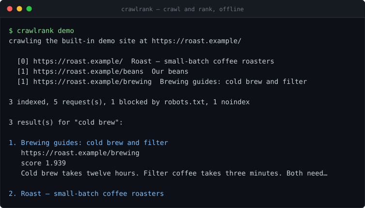

# crawlrank

[](https://github.com/KRISH123no/crawlrank/actions/workflows/ci.yml)



**Point it at a website, get back a search engine for that website.** It crawls without being a
nuisance — obeying robots.txt, one request at a time per host — then ranks what it finds with
BM25, the scoring function underneath Lucene and Elasticsearch.

TypeScript, **no runtime dependencies**: the crawler, the HTML reader, the stemmer and the ranking
maths are all written here.

```bash
npm install && npm run build
node dist/cli.js crawl https://example.com --max-pages 100 --out index.json
node dist/cli.js search '"cold brew" +coffee -decaf'
```

Two halves, each small enough to read in a sitting:

- **The crawler** — robots.txt, one request in flight per host, a politeness gap between requests
  to the same host, exponential backoff with jitter, page and depth budgets.
- **The index** — an inverted index with positions, Porter stemming, BM25 ranking with a title
  boost, and phrase queries.

## Try it without a network

```bash
npx tsx src/cli.ts demo
```

That crawls a small fake site built into the repo. Its robots.txt disallows `/admin`, one page
carries `<meta name="robots" content="noindex">`, and one URL redirects — so the run exercises the
awkward parts, not just the happy path:

```
  [0] https://roast.example/  Roast — small-batch coffee roasters
  [1] https://roast.example/beans  Our beans
  [1] https://roast.example/brewing  Brewing guides: cold brew and filter

3 indexed, 5 request(s), 1 blocked by robots.txt, 1 noindex

1 result(s) for "\"small batches\"":

1. Roast — small-batch coffee roasters
   https://roast.example/
   score 3.386
```

## What "polite" means here

Politeness is the design constraint, not a setting. Concurrency comes from crawling *different*
hosts at once, never from putting more load on one:

| Rule | How |
|---|---|
| Obey robots.txt | RFC 9309 matching: most specific user-agent group, `*` and `$` patterns, longest rule wins, `Allow` breaks a tie |
| One request per host at a time | Each host has a `readyAt` timestamp, reserved by a synchronous read-modify-write |
| Leave a gap | `--delay` between requests to the same host; a longer `Crawl-delay` in robots.txt overrides it, a shorter one does not |
| Back off when told | Retries on network errors, `429` and `5xx` only, with exponential backoff and jitter |
| Stop | `--max-pages`, `--depth`, a byte cap per response, a request timeout |
| Fetch robots.txt once | Cached per host as a promise, so concurrent workers share one request |

The reservation being *synchronous* is the whole trick. An earlier version resolved the delay in
between reading a host's `readyAt` and writing it back, so two workers could read the same value
and book the same slot. The test that catches it asserts the gap between consecutive requests to
one host under fake timers.

## Ranking

BM25, with the title treated as a boosted region of the same token stream:

$$\text{score}(q,d) = \sum_{t \in q} \text{IDF}(t) \cdot \frac{f'_{t,d}\,(k_1+1)}{f'_{t,d} + k_1\left(1-b+b\frac{|d|}{\text{avgdl}}\right)}$$

- $f'_{t,d}$ counts a title occurrence `titleBoost` times (default 3) and a body occurrence once.
- $k_1$ (default 1.2) controls saturation: the fifth occurrence of a word adds far less than the
  first, which is what stops keyword stuffing from working.
- $b$ (default 0.75) controls length normalisation. At `b: 0`, a long document stops being
  penalised — there is a test that asserts exactly that.
- IDF is $\ln\left(1 + \frac{N - df + 0.5}{df + 0.5}\right)$, which stays positive for a term that
  appears in most of the collection.

Storing the title first in one token stream, and remembering where it ends, means a title match can
be boosted *and* a phrase can run from the title into the body — without indexing the title twice.

### Query syntax

| Input | Meaning |
|---|---|
| `coffee shop` | both terms rank; neither is required |
| `+coffee shop` | `coffee` must appear |
| `-decaf` | documents containing `decaf` are dropped |
| `"cold brew"` | the words must appear adjacent and in order |

Queries and documents run through the identical pipeline — case folding, stop words, Porter
stemming — so a search for `running` finds a page that said `runs`. Stop words are *kept* inside a
quoted phrase, because dropping "the" from `"the cold brew"` would break the position arithmetic.

## The stemmer

`src/stem.ts` is a full implementation of Porter (1980): steps 1a through 5b, with the measure `m`
guard that stops it mangling short words. It reproduces all 76 worked examples from the original
paper, and those examples are the test suite:

```
caresses → caress    ponies → poni       agreed → agre      motoring → motor
rational → ration    plastered → plaster hopping → hop      sensibiliti → sensibl
```

## Library use

```ts
import { Crawler, parseQuery } from "crawlrank";

const { index, report } = await new Crawler({
  maxPages: 200,
  delayMs: 1000,
  concurrency: 4,
}).crawl(["https://example.com"]);

console.log(`${report.pages} pages from ${report.requests} requests`);
for (const hit of index.search(parseQuery("+api reference"), 5)) {
  console.log(hit.score.toFixed(2), hit.url, hit.snippet);
}
```

The network is a constructor option (`fetcher`), which is why the tests can drive a complete
crawl — redirects, retries, backoff, politeness — without opening a socket.

## Layout

| File | Lines | Role |
|---|---:|---|
| `crawler.ts` | 334 | worker pool, robots cache, per-host scheduling, retries |
| `index-store.ts` | 265 | inverted index, BM25, phrase matching, persistence |
| `cli.ts` | 174 | `crawl`, `search`, `stats`, `demo` |
| `stem.ts` | 160 | Porter stemmer |
| `robots.ts` | 133 | robots.txt parser and matcher |
| `html.ts` | 104 | tolerant title/text/link extraction |
| `url.ts` | 86 | canonicalisation, so one page is one frontier entry |
| `frontier.ts` | 83 | dedupe, depth limits, host round-robin |
| `query.ts` | 72 | query syntax |
| `tokenize.ts` | 39 | the pipeline shared by indexing and search |

1,539 lines of source, 837 lines of tests.

## Tests

```bash
npm test        # 153 tests, no network, under a second
npm run typecheck
```

TypeScript runs in `strict` mode with `noUncheckedIndexedAccess` and `exactOptionalPropertyTypes`.

The tests worth looking at: politeness and `Crawl-delay` under vitest fake timers; backoff
asserting the exact retry delays `[100, 200]`; the frontier proving it rotates hosts rather than
draining one; BM25 saturation asserting five occurrences score less than five times one; phrase
matching rejecting `brew it cold` for `"cold brew"`.

## Deliberate limits

- **No JavaScript rendering.** Pages are parsed as delivered; a client-rendered site yields little text.
- **No persistence during a crawl.** The index is held in memory and written at the end, so it is
  sized for tens of thousands of pages, not millions.
- **No sitemap fetching.** `Sitemap:` lines are parsed out of robots.txt and exposed, but not followed.
- **No learned ranking and no link analysis.** BM25 over text only — despite the name, nothing here computes PageRank.
- **Regex HTML parsing.** Deliberate: it must never throw on broken markup, and a real parser is a
  dependency. It strips `script`/`style`/`head` and resolves links; it does not build a DOM.

## Licence

MIT.
